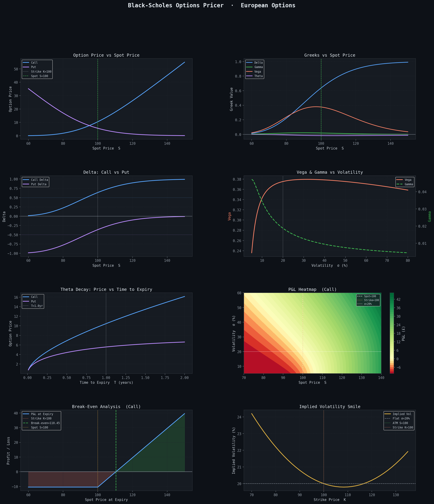

# Black-Scholes Options Pricer

Analytical pricing of European options using the Black-Scholes model. Computes option prices, all five Greeks, implied volatility, put-call parity verification, and break-even analysis — with an interactive CLI mode and 8-panel visualisation.

## Features

- **Analytical pricing** — closed-form Black-Scholes for European calls and puts
- **All five Greeks** — Δ Delta, Γ Gamma, ν Vega, θ Theta, ρ Rho
- **Implied volatility solver** — Brent's root-finding method
- **Put-call parity verification** — confirms C - P = S - Ke^(-rT) with <1e-10 error
- **Break-even analysis** — premium-adjusted expiry break-even with P&L diagram
- **P&L heatmap** — profit/loss across spot price × volatility grid
- **Interactive CLI** — input parameters at runtime with `--interactive`
- **8-panel visualisation** — price, Greeks, delta, vega/gamma, theta decay, heatmap, break-even, IV smile

## Output

```
════════════════════════════════════════════════════════
  BLACK-SCHOLES PRICER  ·  European CALL
════════════════════════════════════════════════════════
  Spot S=100  |  Strike K=100  |  T=1.0yr
  r=5.0%  |  σ=20%  |  ATM
────────────────────────────────────────────────────────
  Price          : 10.4506
  Break-even     : 110.4506  (premium = 10.4506)
────────────────────────────────────────────────────────
  Δ Delta        : +0.6368
  Γ Gamma        : +0.0188
  ν Vega         : +0.3752  (per 1% Δσ)
  θ Theta        : -0.0176  (per day)
  ρ Rho          : +0.5323  (per 1% Δr)
────────────────────────────────────────────────────────
  Put-Call Parity:
    Call=10.4506  Put=5.5735
    C - P = 4.8771  |  S - Ke^(-rT) = 4.8771
    Parity error  : 0.00e+00  ✓
════════════════════════════════════════════════════════
```



## Installation

```bash
pip install numpy scipy matplotlib
```

## Usage

**Default parameters:**
```bash
python black_scholes_pricer.py
```

**Interactive mode** — enter your own parameters at runtime:
```bash
python black_scholes_pricer.py --interactive
```

```
  Spot price          S [100]: 110
  Strike price        K [100]: 105
  Time to expiry (yr) T [1.0]: 0.5
  Risk-free rate      r [0.05]:
  Volatility          σ [0.20]: 0.25
  Option type (call/put) [call]: put
```

**Use as a module:**
```python
from black_scholes_pricer import black_scholes, greeks, implied_volatility

price = black_scholes(S=100, K=100, T=1.0, r=0.05, sigma=0.20, option_type="call")
g     = greeks(S=100, K=100, T=1.0, r=0.05, sigma=0.20, option_type="call")
iv    = implied_volatility(market_price=10.45, S=100, K=100, T=1.0, r=0.05)
```

## Dependencies

| Library | Use |
|---------|-----|
| `numpy` | Vectorised maths, array operations |
| `scipy` | `norm` CDF/PDF for BS formula; `brentq` for IV solver |
| `matplotlib` | 8-panel visualisation, P&L heatmap |

## Related Project

[Monte Carlo Option Pricer](https://github.com/michaelchak6/monte-carlo-option-pricer) — prices the same European options via 100,000 GBM simulations; benchmarks against this analytical pricer achieving <0.3% pricing error.
